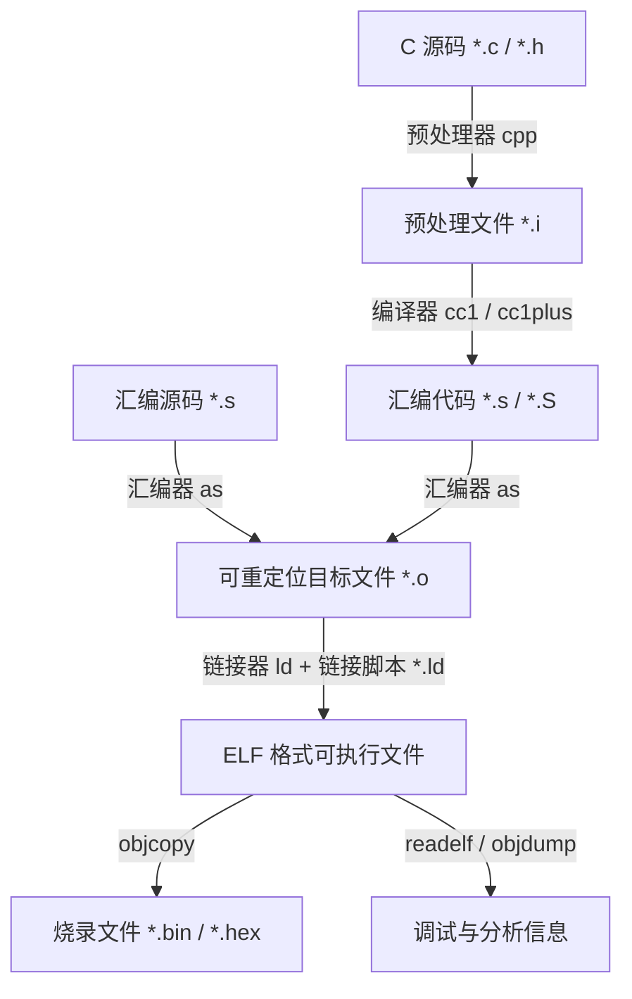

# 第一章：编译链接阶段与链接脚本基本语法

在嵌入式开发中，将高级语言编写的源代码转化为可在微控制器（MCU）裸机上直接运行的机器指令，是一个极其复杂且严密的工程。本章将从底层编译链接流水线出发，深度剖析可重定位目标文件的内部组织，进而介绍 GNU 链接器（GNU `ld`）的核心链接机制以及链接脚本的基本语法规则。

---

## 1. GNU 工具链的编译与链接流水线

微控制器无法直接理解 C/C++ 语言，它们只能读取特定的机器码。GNU 编译工具链（GCC）通过一系列工具链程序完成这一转换流程：



### 1.1 预处理与编译阶段
1. **预处理（Preprocessing）**：使用 `cpp` 对所有的宏定义（`#define`）、条件编译指令（`#ifdef`）进行展开，并将 `#include` 头文件包含进 `.c` 文件中，生成纯 C 语言临时文件 `.i`。
2. **编译（Compilation）**：使用 `cc1` 或 `cc1plus` 编译器将 `.i` 代码转换为针对特定 CPU 架构（如 ARM Cortex-M 或 RISC-V）的汇编指令 `.s`。

### 1.2 汇编阶段与 ELF 结构
汇编器 `as` 将汇编指令翻译成二进制机器码，生成可重定位目标文件（`.o`），其格式通常为 ELF（Executable and Linkable Format）。此时目标文件内部各段的相对位置已经确定，但尚未绑定到硬件的绝对地址。

```text
+--------------------------------------------+
|                  ELF Header                | -> 包含魔数(Magic)、目标架构、Section Header Table 的偏移量
+--------------------------------------------+
|             .text (代码段段内容)           | -> 包含编译后的机器指令
+--------------------------------------------+
|            .rodata (只读数据段)            | -> 常量、字符串字面量
+--------------------------------------------+
|             .data (已初始化数据)           | -> 带有初始值的全局/静态变量
+--------------------------------------------+
|             .bss (未初始化数据)            | -> 仅记录长度，不占 ELF 文件空间（上电清零）
+--------------------------------------------+
|        .symtab & .strtab (符号表)          | -> 记录当前文件定义或引用的全局/局部符号
+--------------------------------------------+
|         .rel.text / .rel.data (重定位表)   | -> 包含需在链接时修正的指令或数据的地址引用列表
+--------------------------------------------+
|             Section Header Table           | -> 描述每个 Section 的名称、类型、偏移量及大小
+--------------------------------------------+
```

* **重定位表（Relocation Table）**：例如 `.rel.text`，它向链接器汇报：“在当前 `.text` 的第 `0x24` 字节处有一条跳转指令，调用的函数是 `SystemInit`，因为我（编译期）不知道它的真实物理地址，所以暂时填入 `0x00000000`。请链接器在此处进行修改。”

### 1.3 链接器的核心机制：符号解析与重定位

链接器（`ld`）的主要任务是将多个 `.o` 文件与静态库（`.a`）组合，并在重定位表中完成占位符的物理地址替换。

#### A. 符号解析（Symbol Resolution）
链接器分析每个目标文件的符号表，确保每个被引用的外部符号都在另一个 `.o` 文件或库中被定义：
* **未定义符号**：如果在所有输入文件中均找不到某个符号（如 `printf`），链接器将抛出著名的错误：`undefined reference to 'printf'`。
* **重复定义符号**：若在两个不同的源文件中定义了同名的非 weak 全局变量或函数，链接器将报错：`multiple definition of 'xxx'`。

#### B. 重定位（Relocation）
链接器首先依据链接脚本的指示，将所有目标文件中同名的 Section 进行合并，并基于 `MEMORY` 属性和当前的定位计数器，为各个段以及其中的每个符号分配合适的虚拟运行地址（VMA）和加载地址（LMA）。

一旦符号的绝对地址被确定下来，链接器将回溯所有重定位表（`.rel` 段），将之前编译阶段写入的 `0x00000000` 占位符修改为真实的偏移量或绝对地址。

```text
【编译阶段汇编指令（未重定位）】
0x00000000:  BL  0x00000000   <--- 这里的跳转目标是占位符 0

【链接阶段重定位后（绝对地址确定）】
若 Reset_Handler 被分配到了 0x08000100，当前指令地址为 0x08000020：
0x08000020:  BL  0x08000100   <--- 链接器计算相对偏移，填入真实的机器跳转码
```

---

## 2. 链接器脚本（Linker Script）语法详解

链接器脚本是后缀通常为 `.ld` 的文本文件。它向链接器明确传达：
1. 微控制器的物理存储配置有多大，从什么地址开始（`MEMORY` 命令）。
2. 输入的各段（`.text`、`.data` 等）应该放置在哪个物理存储区中，并且以什么样的顺序、如何进行内存对齐（`SECTIONS` 命令）。
3. 程序的启动入口在哪里（`ENTRY` 命令）。

### 2.1 整体骨架
```ld
/* 1. 指定程序的起始入口点（汇编或者 C 函数） */
ENTRY(Reset_Handler)

/* 2. 声明硬件物理存储块 */
MEMORY
{
    /* 内存块定义 */
}

/* 3. 描述输出段与输入段的映射规则 */
SECTIONS
{
    /* 段映射定义 */
}
```

---

## 3. MEMORY 命令：物理存储空间布局

`MEMORY` 块用于声明硬件平台中实际存在的物理存储介质（如 Internal Flash、SRAM、CCM SRAM、外部 SDRAM 等）。

### 3.1 语法格式
```ld
MEMORY
{
    name (attr) : ORIGIN = origin_address, LENGTH = length_size
}
```

* **`name`**：存储区的用户自定义名称（如 `FLASH`、`RAM`）。此名称仅在链接脚本内部可见。
* **`attr`（属性标志）**：告诉链接器该存储区具有哪些物理特性，以便在没有显式指定映射目标时，链接器可以自动放置某些段：
  * **`r` (read-only)**：只读区。通常代表 Flash，放置只读代码和常量。
  * **`w` (read-write)**：读写区。通常代表 SRAM，放置可变变量。
  * **`x` (executable)**：可执行区。可以从中取出指令并执行。
  * **`a` (allocatable)**：可分配区。表示上电时该区域有真实的物理实体。
  * **`i` / `l` (initialized)**：已初始化区。
* **`ORIGIN`**：该存储块的起始物理基地址（如 `0x08000000`）。
* **`LENGTH`**：存储区的大小。支持使用 `K`（Kibibytes）或 `M`（Mebibytes）作为单位。

### 3.2 生产级示例：Cortex-M 微控制器物理存储声明
```ld
/* 声明 STM32F407 典型的存储布局 */
MEMORY
{
    /* 内置 Flash：只读且可执行，大小为 512KB，起始于 0x08000000 */
    FLASH  (rx)  : ORIGIN = 0x08000000, LENGTH = 512K
    
    /* 系统 SRAM：可读写、可执行，大小为 128KB，起始于 0x20000000 */
    RAM    (rwx) : ORIGIN = 0x20000000, LENGTH = 128K
    
    /* 核心紧耦合 RAM (CCMRAM)：直接连接至 CPU D-Bus，不支持 DMA，大小为 64KB */
    CCMRAM (rw)  : ORIGIN = 0x10000000, LENGTH = 64K
}
```

---

## 4. SECTIONS 命令与定位计数器（Location Counter）

`SECTIONS` 块是整个链接脚本的核心，指导链接器将输入的同名目标段重新排布并最终分配到 `MEMORY` 指定的存储区。

### 4.1 定位计数器 `.` 的本质与规则
符号句点 `.` 代表**定位计数器（Location Counter）**。
* **物理意义**：`.` 指向当前输出 Section 的当前 VMA（运行地址）。
* **自动递增**：随着每个输入目标段数据被写入，链接器会自动将段大小累加到 `.` 的数值上。
* **强制定位**：你可以通过显式对 `.` 赋值来强制控制下一个段的起始地址（只能增加，不能减少）。
  ```ld
  . = 0x20001000; /* 下一个段将从该物理地址处开始编排 */
  ```
* **单向移动规则**：
  > [!WARNING]
  > 定位计数器 `.` **只能单向向前（地址变大）移动，严禁回退**。例如 `. = . - 0x10;` 会引发链接器抛出 `backward move` 异常。

### 4.2 内存对齐：ALIGN 函数
为了防止 CPU 在读写 32 位或 64 位数据时因地址未对齐而导致硬件故障（如 ARM 平台上的 `UsageFault` 或 `HardFault`），我们必须将某些段的起始及结束边界进行对齐。

```ld
. = ALIGN(4); /* 将当前定位计数器向上舍入到 4 字节的倍数 */
```
**对齐计算公式**：
若当前 `.` 的值为 `0x20000003`，执行 `. = ALIGN(4);` 后，定位计数器将被强制设置为 `0x20000004`，其间缺少的 1 个字节将由链接器自动插入填充字节（Padding Bytes）。

---

## 5. 核心链接器指令与机制

### 5.1 KEEP 指令与垃圾回收（Garbage Collection）
在构建固件时，为缩减体积，我们常在 GCC 编译选项中加入 `-ffunction-sections` 与 `-fdata-sections`，这会让编译器为每个函数与全局变量单独创建段（例如 `void foo()` 会被编译进 `.text.foo`）。
同时，在链接器参数中加入 `--gc-sections`，告诉链接器：“在符号引用分析完毕后，删除所有未被调用的函数和段”。

然而，有一些段在 C 调用链中是“不可达”的，但硬件在特定事件发生时会自动读取它们，最典型的例子就是**中断向量表（Vector Table）**。如果它被剪裁掉，芯片上电将直接崩溃。

为防止被垃圾回收机制移除，必须使用 `KEEP()`：
```ld
KEEP(*(.isr_vector)) /* 强制链接器永久保留该段，严禁裁剪 */
```

### 5.2 PROVIDE 与 PROVIDE_HIDDEN 指令
* **`PROVIDE(symbol = expression);`**：定义一个导出到符号表中的变量。如果用户的 C 语言源码中定义了同名变量，则使用 C 语言的定义；若没有，则使用此处链接脚本定义的值。
* **`PROVIDE_HIDDEN(symbol = expression);`**：定义一个局部导出变量，该变量的生命周期仅限于当前 ELF 可执行二进制文件内部，防止被外部动态链接库覆盖。

### 5.3 ENTRY 指令
`ENTRY(symbol_name)` 显式向 ELF 头部的 Entry Point 字段写入入口点地址。
对于 Cortex-M 裸机系统，虽然硬件在上电时会自动读取中断向量表的第 2 项作为复位函数并开始执行，但在 ELF 头部声明 `ENTRY(Reset_Handler)` 可以保证 GDB 调试器或 J-Link 在加载 ELF 调试信息时，能够直接将 PC 寄存器指引到正确的初始化起点。
